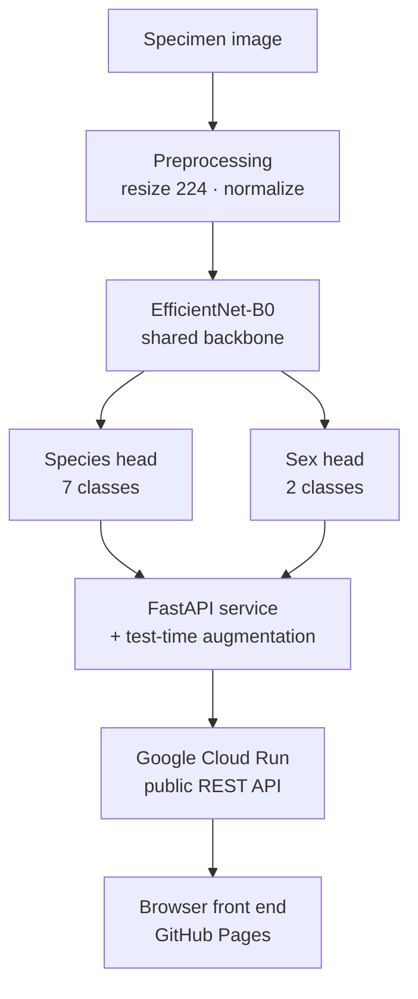

<h1 align="center">VectorID</h1>

<p align="center">
  <b>Mosquito species &amp; sex identification from a single photograph.</b><br>
  A two-head EfficientNet-B0 classifier (7 species, 2 sexes), built as a portfolio project exploring the architecture behind <b>VectorCam</b>, the Johns Hopkins CBID platform for AI-assisted malaria vector surveillance.
</p>

<p align="center">
  <a href="https://523vishwanath.github.io/VectorCam_Mosquito_classifier/">
    
  </a>
  <a href="https://mosquito-classifier-207189004007.us-central1.run.app/docs">
    
  </a>
  <a href="https://www.comet.com/vishwanath-reddy/vectorcam-mosquito">
    
  </a>
</p>

<p align="center">
  <a href="https://523vishwanath.github.io/VectorCam_Mosquito_classifier/">
    
  </a>
  <br>
  <sub><i>&uarr; VectorID running live &mdash; click to try it yourself</i></sub>
</p>

<p align="center">
  
  
  
  
  
</p>

---

## How VectorID relates to VectorCam / VectorBrain

VectorCam's published model, **VectorBrain** ([Li et al., 2024](https://doi.org/10.21203/rs.3.rs-4462833/v1)), predicts mosquito **species, sex, and abdominal status simultaneously** from one specimen image, on mobile hardware, trained on proprietary field data. VectorID is an independent portfolio reimplementation of the *core idea* — a shared backbone with independent task heads — on public data, to demonstrate the engineering rather than to reproduce their result.

| Capability | VectorBrain (JHU) | VectorID (this project) |
|---|---|---|
| Species classification | ✅ | ✅ (7 classes) |
| Sex classification | ✅ | ✅ |
| Abdomen status | ✅ | ❌ — planned (no public label exists; see below) |
| Multi-task, shared backbone | ✅ | ✅ |
| Deployment target | Mobile (on-device) | Google Cloud Run (REST API) + browser front end |
| Training data | Proprietary field images | Public CDC/MR4 reference images |

> **This is not a benchmark against VectorBrain.** VectorID uses public reference-quality images and is not trained on VectorCam's proprietary field dataset, so the numbers here should not be compared directly with their published results. It is a learning project meant to show relevant engineering and an understanding of their approach.

---

## Try it live

Upload a photo in the [**VectorID web app**](https://523vishwanath.github.io/VectorCam_Mosquito_classifier/) — it accepts single images or batches and works with a phone camera.

No mosquito photo handy? Ten labelled specimens live in [`samples/`](samples/). Download one and drop it in, or call the API directly:

```bash
curl -X POST -F "file=@samples/aedes_aegypti_female.jpg" \
  https://mosquito-classifier-207189004007.us-central1.run.app/predict
```

```json
{ "species": "aedes_aegypti", "species_confidence": 0.70,
  "sex": "female", "sex_confidence": 0.81 }
```

<table>
  <tr>
    <td align="center"><br><sub><i>Aedes aegypti</i> ♀</sub></td>
    <td align="center"><br><sub><i>Aedes aegypti</i> ♂</sub></td>
    <td align="center"><br><sub><i>An. albimanus</i> ♀</sub></td>
    <td align="center"><br><sub><i>An. albimanus</i> ♂</sub></td>
    <td align="center"><br><sub><i>An. arabiensis</i> ♀</sub></td>
  </tr>
  <tr>
    <td align="center"><br><sub><i>An. arabiensis</i> ♂</sub></td>
    <td align="center"><br><sub><i>An. atroparvus</i> ♀</sub></td>
    <td align="center"><br><sub><i>An. farauti</i> ♀</sub></td>
    <td align="center"><br><sub><i>An. farauti</i> ♂</sub></td>
    <td align="center"><br><sub><i>An. freeborni</i> ♀</sub></td>
  </tr>
</table>

> Try `anopheles_arabiensis_female.jpg` — it's one of the model's hardest cases (see [Results](#results)).
>
> The API scales to zero when idle, so the first request after a pause takes a few seconds to wake. Later requests are fast.

---

## The web app

The [live front end](https://523vishwanath.github.io/VectorCam_Mosquito_classifier/) is a single-page app that talks directly to the deployed API. What it does:

- **Accepts uploaded images** — one at a time or a whole batch — by file picker or drag-and-drop.
- **Captures photos directly on mobile.** On a phone, a "Take a photo" button opens the rear camera so a specimen can be photographed and identified on the spot, without saving a file first.
- **Handles unrelated or unclear images gracefully.** Because the model has no "not a mosquito" category (see [limitations](#limitations)), the app applies a 50% confidence floor: if nothing scores above it, the result comes back as *"try a clearer mosquito photo"* rather than a confident but meaningless species label. This catches many non-mosquito, blurry, or off-target uploads, though it's a heuristic rather than true detection.
- **Links to sample specimens.** Right below the upload area, a link points to the [`samples/`](samples/) folder so anyone without a mosquito photo can grab a labelled test image and try the tool immediately.

### Limitations of the app

- It can only recognise the **7 species it was trained on**. A mosquito of any other species will be forced into the closest of those seven, so a confident answer doesn't guarantee the true species is even in the model's vocabulary.
- The confidence floor reduces obvious mistakes on junk uploads but does not truly "know" when an image is out of distribution.

### On cloud deployment vs. on-device

VectorID runs as a cloud service rather than an on-device model, and for a surveillance tool that is a reasonable, practical choice: mobile connectivity now reaches most field settings, including remote areas of Uganda and neighbouring countries where malaria vector surveillance actually happens, so a phone in the field can call the hosted model over the network and get an answer in about a second. The cloud path also means the model can be updated centrally without pushing an app update to every device.

On-device inference still has clear advantages — it works with no signal at all, has no per-request latency, and keeps data local — which is exactly why the mobile export path (ONNX → TensorFlow Lite, INT8 quantized) is on the [roadmap](#future-work). The two approaches are complementary; cloud is simply the faster path to a working, shareable tool, and a genuinely usable one wherever there's a mobile signal.

---

## System architecture



A single EfficientNet-B0 trunk extracts features; two independent linear heads read species and sex off those shared features. The service wraps the model in FastAPI, containerises it with Docker, and deploys to Cloud Run; the browser front end calls that API directly.

## Why EfficientNet-B0

EfficientNet-B0 was chosen deliberately, not by default:

- **Small-data friendly.** With only ~500 training images, a large model overfits. B0's ImageNet-pretrained features transfer well and, combined with progressive unfreezing, extract more signal than a bigger network would on this little data.
- **Edge-oriented.** B0 is one of the most efficient accuracy-per-FLOP backbones available and exports cleanly to ONNX / TFLite — matching VectorCam's real mobile target.
- **Strong fine-grained baseline.** It has enough capacity to separate visually similar species without the data appetite of a transformer.

**Alternatives, and when they'd win:**

| Model | Trade-off vs B0 |
|---|---|
| EfficientNet-B1–B3 / V2-S | Higher ceiling, but needs more data and compute to justify |
| ConvNeXt-Tiny | Modern CNN, often a bit more accurate at similar size; good mobile option |
| MobileNetV3 / MobileViT | 2–3× faster on-device for a small accuracy cost — the true mobile-first choice |
| ViT / DeiT / Swin | Higher ceiling *with large datasets*; data-hungry and weaker for mobile quantization |

The short version: **with more data, a bigger backbone or a transformer becomes worth it.** At this dataset size, B0 is the right prototype.

## Dataset

CDC/MR4 mosquito image collection ([Dryad, doi:10.5061/dryad.z08kprr92](https://doi.org/10.5061/dryad.z08kprr92)).

- The original collection is described as **~1,700 images across 15+ species**.
- Only **~740 images downloaded successfully** from the archive at the time of retrieval, so this project works with that subset.
- After filtering to species that had **enough samples in both sexes to train and evaluate reliably**, the working set covers **7 species across 3 genera** (*Anopheles*, *Aedes*, *Culex*).

Labels are embedded in each filename (`genus_species_sex_strain_imagenumber.jpg`) and parsed into a structured `labels.csv` with an integer id per head. A stratified 70/15/15 split keeps class proportions consistent across train, validation, and test.

**Known dataset limitations, stated plainly:**
- The set is imbalanced — 219 *Ae. aegypti* down to 36 *An. atroparvus*.
- *An. atroparvus* has **no male images at all**, so sex generalisation for that species is untested.
- These are clean, reference-quality lab images — not the messy field images VectorCam actually deals with. Field performance would be lower.
- **More data is the single biggest lever for improvement here**: recovering the full ~1,700-image set, adding species, and (eventually) real field images would all raise the ceiling more than any architecture change.

## Training

**Two heads, one backbone.** Both heads' cross-entropy losses are summed and share one backbone, so the features learned serve both tasks — more data-efficient than two separate models.

**Class-weighted, label-smoothed loss.** The species head is weighted by *square-root* inverse frequency — full inverse-frequency weighting over-corrected and hurt the common classes, so the sqrt softens it. Label smoothing (0.1) discourages overconfidence.

**Three-stage progressive unfreezing** (the key trick for small data):

| Stage | What trains | Learning rate | Purpose |
|---|---|---|---|
| 1 | Heads only (backbone frozen) | 1e-3 | Let random heads learn to read pretrained features without corrupting them |
| 2 | Last 3 backbone blocks + heads | 1e-4 | Adapt the highest-level features toward mosquito morphology |
| 3 | Full network | 1e-5, early stopping | Squeeze out the last gains without wrecking earlier progress |

Each stage keeps its own best checkpoint and logs to a separate [Comet ML](https://www.comet.com/vishwanath-reddy/vectorcam-mosquito) experiment. Augmentation uses both-axis flips (a mounted specimen has no canonical orientation), rotation, colour jitter, and scale/crop jitter. At inference, test-time augmentation averages predictions over flip variants.

## Results

| Metric | Test (with TTA) |
|---|---|
| Species macro-accuracy | **89.4%** |
| Sex macro-accuracy | **92.6%** |


*Species confusion matrix (left) and sex confusion matrix (right).*

### Failure cases — where and why it breaks

VectorCam cares more about understanding failure than chasing 99% accuracy, so here is where VectorID fails:

- **_An. arabiensis_ ↔ _An. coluzzii_** — the dominant error. These are sibling species in the *An. gambiae* complex, hard to separate on morphology alone even for trained entomologists. The VectorBrain paper reports the same difficulty.
- **Minority-class instability** — *An. atroparvus* has only a handful of test images and no males, so its metrics are noisy and one flipped prediction swings the number several points.
- **No out-of-distribution rejection** — the model has no "not a mosquito" class, so a softmax always lands on one of the 7 species. It will confidently label a photo of anything. The web app applies a 50% confidence floor as a rough guard, but that is a heuristic, not real OOD detection.
- **Expected field-data failure modes** — blur, wing occlusion, poor lighting, and debris were not present in this clean lab dataset, so the model is untested against them. These are exactly the conditions field deployment would introduce, and closing that gap needs field data.

## Inference speed

Measured end-to-end against the live API from a laptop — so these numbers include the network round-trip and the image upload, not just model compute.

| Request | Latency |
|---|---|
| Warm request | **~1.1 s** end-to-end (network + ~2 MB upload + test-time augmentation) |
| Cold start (first request after the service has been idle) | **~31 s** |

The warm figure is what a user actually experiences once the service is running, and most of that second is network and upload rather than the model itself — inference runs three times per request because of test-time augmentation, and still finishes quickly.

**Why the first request is slow.** Cloud Run scales down to zero instances when the service is idle, which keeps it free to host. The first request after a pause has to spin a container back up — load Python, PyTorch, and the model weights — before it can answer, and that cold start takes about half a minute. Every request afterwards, while the instance stays warm, lands in the ~1 s range. This is normal serverless behaviour, and the web app tells the user to expect it. Shrinking that cold start is one of the reasons the mobile export path (a much lighter runtime) is on the roadmap.

## Future work

Aligned with VectorCam's own roadmap:

- **Add a detection stage for messy field images** — the current model classifies images that are already tightly focused on a single mosquito against a clean background, which is how the training data was captured. Real field photos have clutter, multiple insects, and irrelevant background. The natural fix is a two-stage pipeline: run a detector (e.g. YOLO) first to find and crop the mosquito, then hand that crop to this classifier. This wasn't needed here because the dataset images were already clean and centred, but it's the standard approach for real-world deployment and the direction VectorCam's own workflow points.
- **Add the abdomen-status head** (unfed / fed / gravid) — the architecture already supports it via the masked-loss pattern used for partial labels; it needs the field data VectorBrain trained on.
- **Quantize for TensorFlow Lite / Core ML** — INT8 export for true on-device mobile inference (a benchmark notebook is already included).
- **Evaluate on unseen geographic domains** — test how a lab-trained model degrades on field images from different regions.
- **Active learning from field images** — sample uncertain field predictions back for labelling to improve iteratively.
- **Drift monitoring** — watch for species-distribution shift by geography and season in production.
- **Recover the full dataset** — retrieve the remaining ~1,000 images and add species for a stronger, broader model.

## Repo structure

```
├── index.html                    # VectorID web front end (GitHub Pages)
├── samples/                      # 10 labelled test specimens
├── notebooks/
│   ├── mosquito_multihead_training.ipynb    # training (Colab, A100)
│   └── mosquito_mobile_export.ipynb         # ONNX/TFLite export + latency benchmark
├── scripts/
│   ├── test_hard_cases.py        # probes the arabiensis/coluzzii confusion via the API
│   └── calibration_check.py      # bins predictions by confidence vs actual accuracy
├── mosquito_deploy/
│   ├── app.py                    # FastAPI inference service (model + TTA)
│   ├── Dockerfile
│   ├── requirements.txt
│   └── mosquito_multihead_effnetb0_final.pt   # trained weights (~16 MB)
└── results/
    ├── demo.gif                  # live-app screen recording
    ├── confusion_matrix.png
    ├── labels.csv
    └── class_maps.json
```

## Running it yourself

**Train** — open `notebooks/mosquito_multihead_training.ipynb` in Colab (A100 recommended), set `ROOT` to your unzipped dataset, run top to bottom.

**Deploy** — see [`mosquito_deploy/README.md`](mosquito_deploy/README.md). In short: `gcloud run deploy --source .` builds the Dockerfile and returns a public URL.

**Export for mobile** — `notebooks/mosquito_mobile_export.ipynb` does ONNX → TFLite conversion, INT8 quantization, and a latency/size benchmark.

## Author

**Vishwanath Ninganolla** — [GitHub](https://github.com/523vishwanath) · [LinkedIn](https://linkedin.com/in/vishwanathninganolla)
