# Mosquito Species + Sex Classifier

A two-head EfficientNet-B0 classifier that identifies mosquito **species** (7 classes) and **sex** from a single photograph. Built as a portfolio project replicating the architecture behind **VectorCam**, the Johns Hopkins CBID platform for AI-assisted malaria vector surveillance.

**[→ Open the web app](https://523vishwanath.github.io/VectorCam_Mosquito_classifier/)** · [API docs](https://mosquito-classifier-207189004007.us-central1.run.app/docs) · [Training dashboard (Comet ML)](https://www.comet.com/vishwanath-reddy/vectorcam-mosquito)

| | |
|---|---|
| **Species accuracy** (test, TTA) | 89.4% |
| **Sex accuracy** (test, TTA) | 92.6% |
| **Species / genera** | 7 species, 3 genera |
| **Stack** | PyTorch · FastAPI · Docker · Cloud Run · Comet ML |

---

## Try it live

Upload a photo in the [web app](https://523vishwanath.github.io/VectorCam_Mosquito_classifier/) — it accepts single images or batches and works with a phone camera.

No mosquito photo handy? Ten labelled specimens live in [`samples/`](samples/). Download one and drop it in, or call the API directly:

```bash
curl -X POST -F "file=@samples/aedes_aegypti_female.jpg" \
  https://mosquito-classifier-207189004007.us-central1.run.app/predict
```

```json
{ "species": "aedes_aegypti", "species_confidence": 0.70,
  "sex": "female", "sex_confidence": 0.81 }
```

<table>
  <tr>
    <td align="center">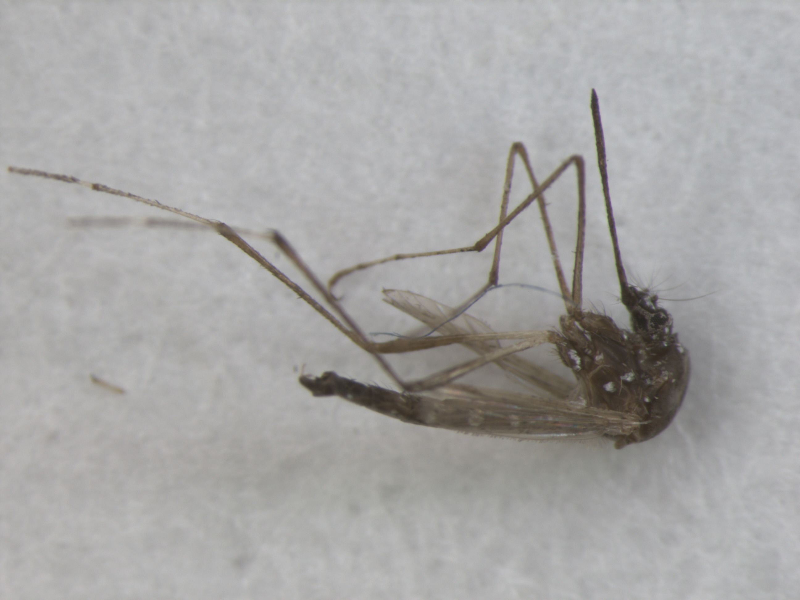<br><sub><i>Aedes aegypti</i> ♀</sub></td>
    <td align="center">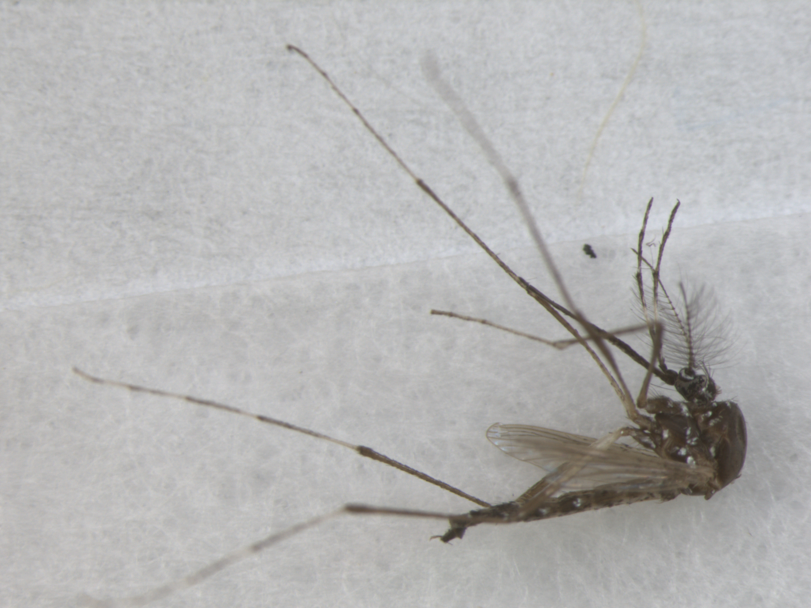<br><sub><i>Aedes aegypti</i> ♂</sub></td>
    <td align="center">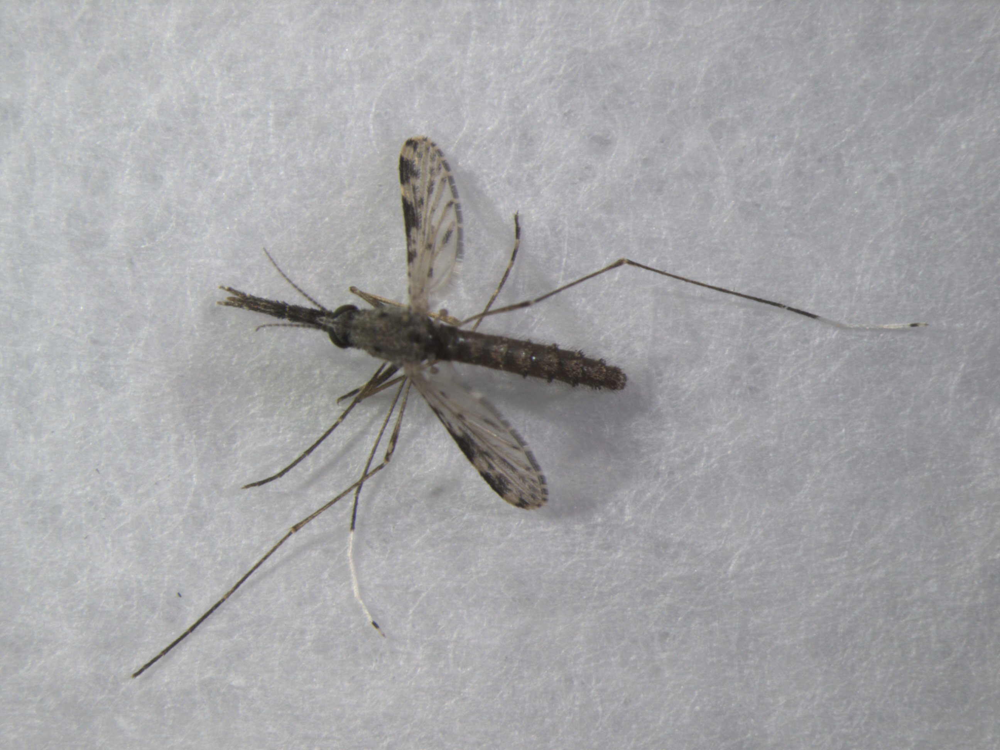<br><sub><i>An. albimanus</i> ♀</sub></td>
    <td align="center">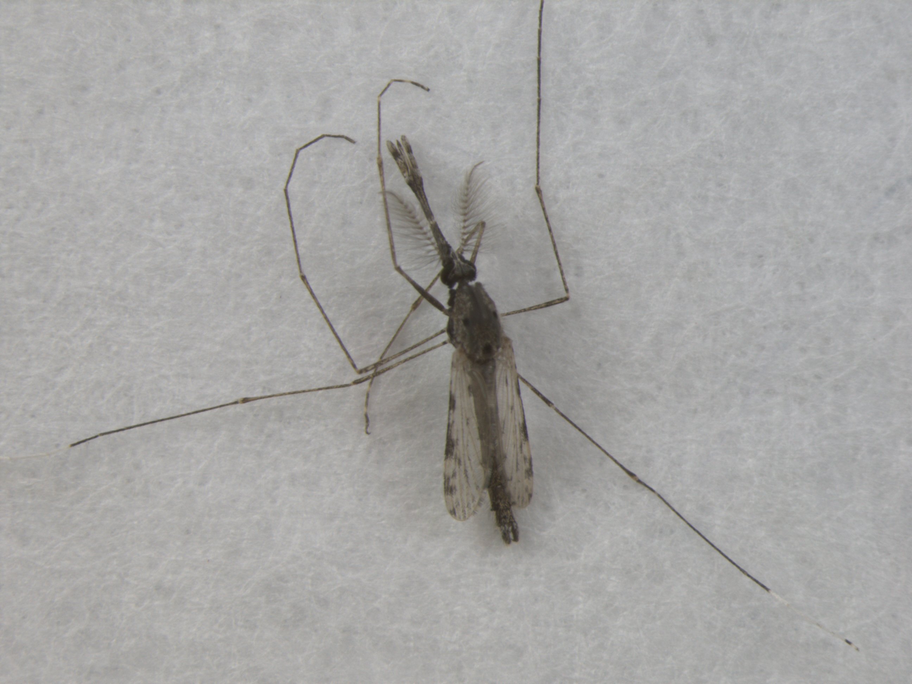<br><sub><i>An. albimanus</i> ♂</sub></td>
    <td align="center">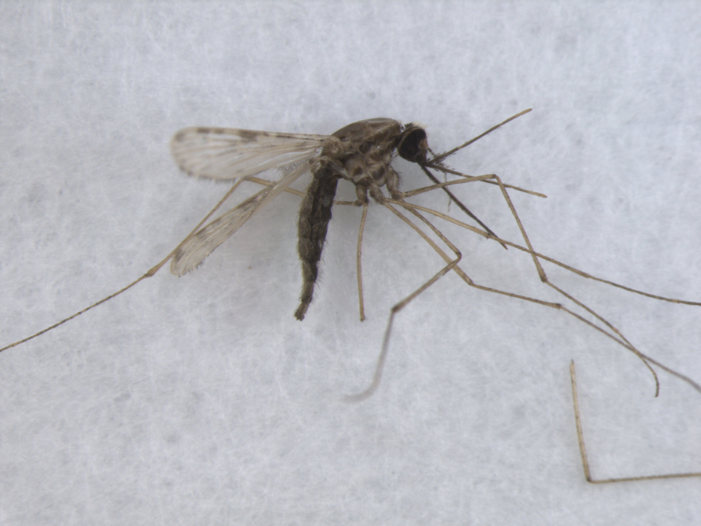<br><sub><i>An. arabiensis</i> ♀</sub></td>
  </tr>
  <tr>
    <td align="center">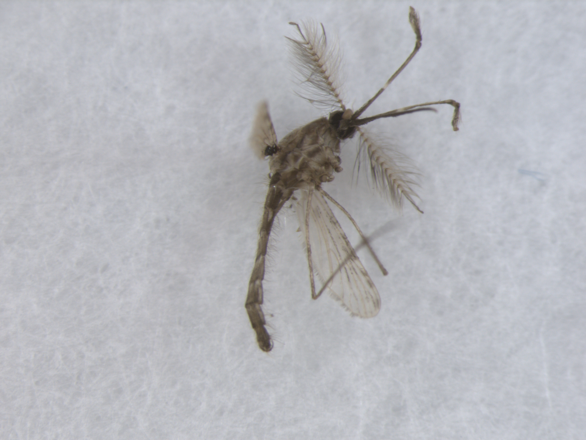<br><sub><i>An. arabiensis</i> ♂</sub></td>
    <td align="center">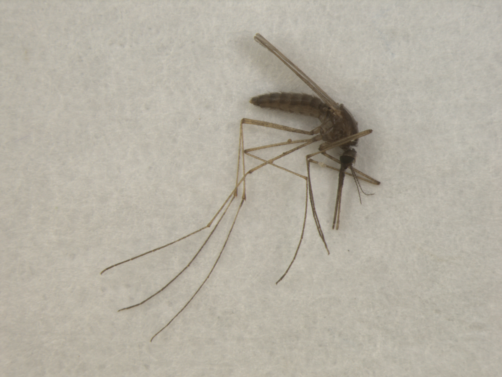<br><sub><i>An. atroparvus</i> ♀</sub></td>
    <td align="center">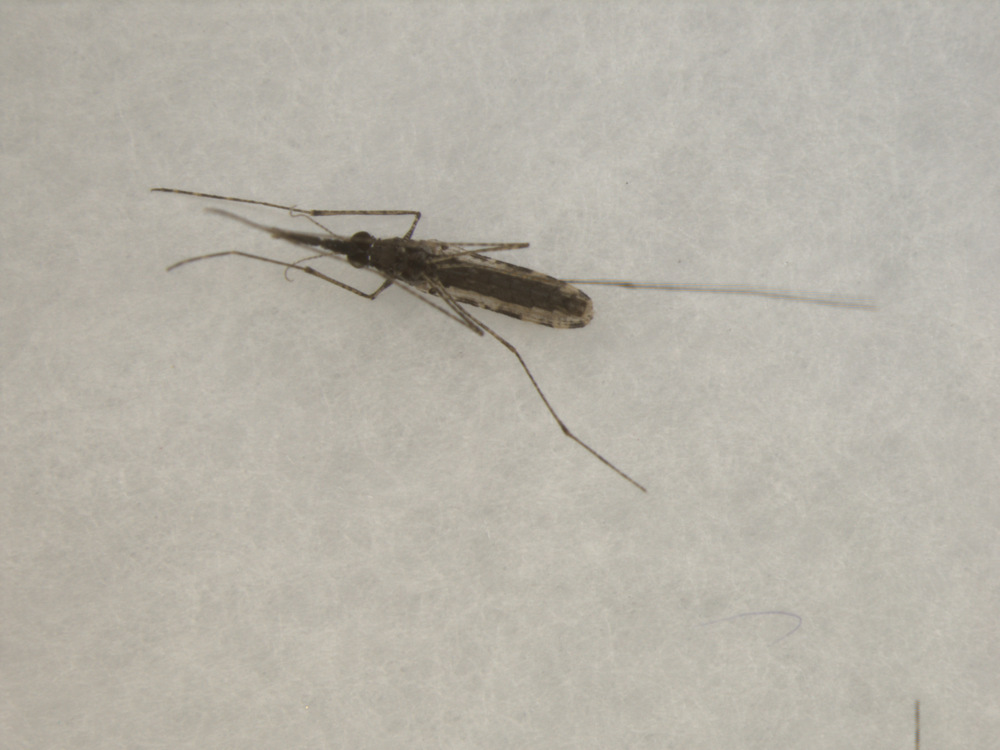<br><sub><i>An. farauti</i> ♀</sub></td>
    <td align="center">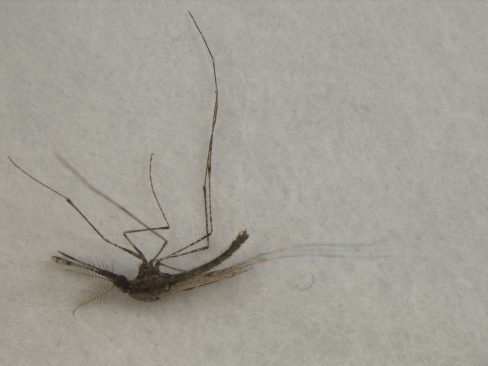<br><sub><i>An. farauti</i> ♂</sub></td>
    <td align="center">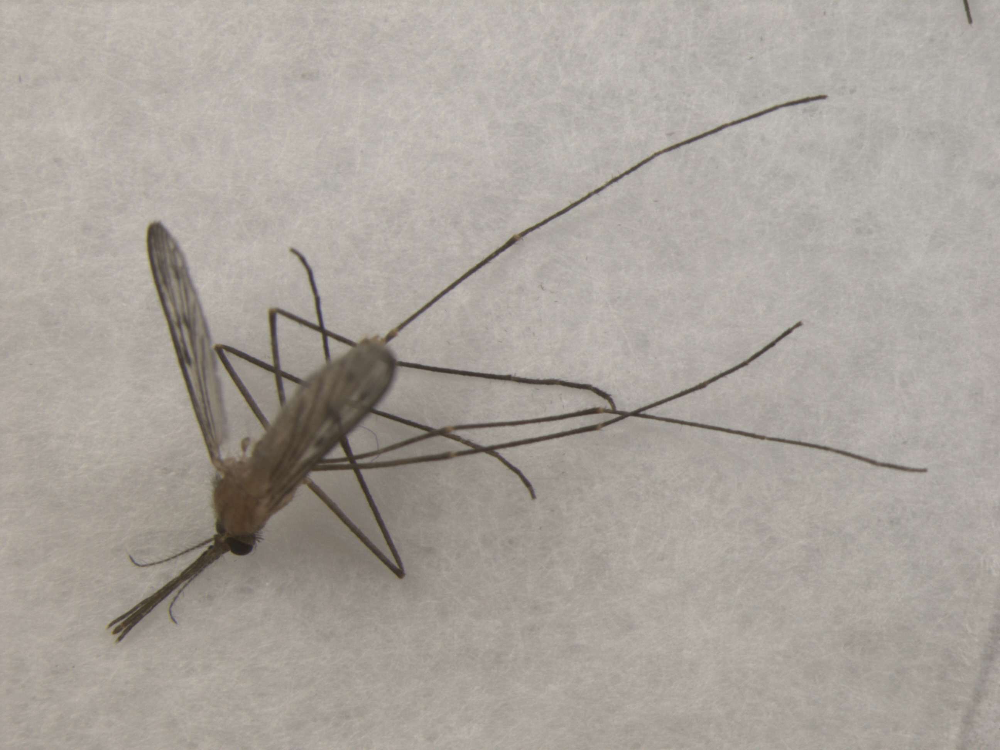<br><sub><i>An. freeborni</i> ♀</sub></td>
  </tr>
</table>

> Try `anopheles_arabiensis_female.jpg` — it's one of the model's hardest cases (see [Results](#results)).
>
> The API scales to zero when idle, so the first request after a pause takes a few seconds to wake. Later requests are fast.

---

## Why this project

VectorCam's model, **VectorBrain** ([Li et al., 2024](https://doi.org/10.21203/rs.3.rs-4462833/v1)), performs concurrent multi-task classification of mosquito species, sex, and abdominal status from one specimen image — a shared CNN backbone feeding independent output heads.

This project reproduces that design on public data and carries it end to end: filename-parsed data pipeline, multi-task training, honest evaluation, containerised API, cloud deployment, and a browser front end.

**On the missing third head.** VectorBrain also classifies abdominal status (unfed / fed / gravid), but no public dataset carries that label — it's field data VectorCam collected in Uganda and Zambia. The architecture here is deliberately built so that head can be dropped in later, reusing the same masked-loss pattern already implemented for labels that only apply to a subset of samples (e.g. a status defined only for females).

## How it works

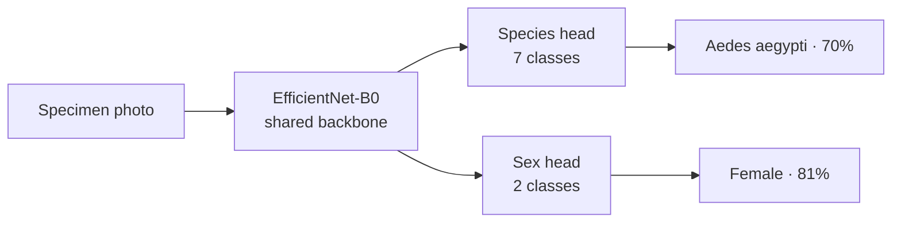

A single EfficientNet-B0 trunk (ImageNet-pretrained) extracts features; two independent linear heads read species and sex off those shared features. Training both tasks against one backbone is more data-efficient than two separate models — the features that describe a mosquito's morphology serve both questions at once.

## Dataset

CDC/MR4 mosquito image collection ([Dryad, doi:10.5061/dryad.z08kprr92](https://doi.org/10.5061/dryad.z08kprr92)) — 740 images, 7 species across 3 genera (*Anopheles*, *Aedes*, *Culex*), both sexes. Labels are embedded in each filename (`genus_species_sex_strain_imagenumber.jpg`) and parsed into a structured `labels.csv` with an integer id per head.

The set is imbalanced — 219 *Ae. aegypti* down to 36 *An. atroparvus* — and *An. atroparvus* has no male images at all. Both facts shape the training choices and the results below. A stratified split (70/15/15) keeps class proportions consistent across train, validation, and test.

## Training

**Class-weighted, label-smoothed loss.** The two heads' cross-entropies are summed. The species head is weighted by *square-root* inverse frequency — full inverse-frequency weighting over-corrected and hurt the common classes, so the sqrt softens it. Label smoothing (0.1) keeps the model from becoming overconfident on a small dataset.

**Three-stage progressive unfreezing.** With only ~500 training images, fine-tuning the whole backbone from the start overfits immediately. Instead:

| Stage | What trains | Learning rate | Purpose |
|---|---|---|---|
| 1 | Heads only (backbone frozen) | 1e-3 | Let random heads learn to read pretrained features without corrupting them |
| 2 | Last 3 backbone blocks + heads | 1e-4 | Adapt the highest-level features toward mosquito morphology |
| 3 | Full network | 1e-5, early stopping | Squeeze out the last gains without wrecking earlier progress |

Each stage keeps its own best checkpoint and logs to a separate [Comet ML](https://www.comet.com/vishwanath-reddy/vectorcam-mosquito) experiment, so each phase's loss curve is visible independently.

**Augmentation & inference.** Training uses both-axis flips (a mounted specimen has no canonical orientation), rotation, colour jitter, and scale/crop jitter — doing much of the work a larger dataset otherwise would. At inference, test-time augmentation averages predictions over flip variants for a small but consistent accuracy gain.

## Results

| Metric | Test (with TTA) |
|---|---|
| Species macro-accuracy | **89.4%** |
| Sex macro-accuracy | **92.6%** |

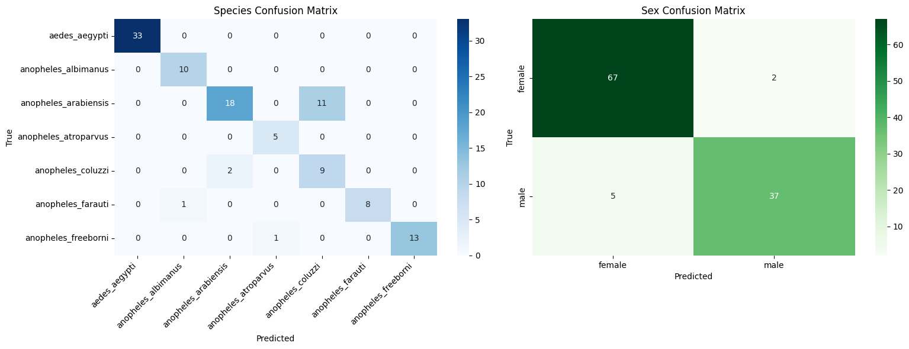

**Where it fails, and why it's honest.** Errors concentrate almost entirely between *An. arabiensis* and *An. coluzzii* — sibling species within the *An. gambiae* complex that are hard to separate on morphology alone, even for trained entomologists. The VectorBrain paper reports the same pattern. This is a property of the problem, not a bug to be optimised away.

**No out-of-distribution rejection.** The model has no "not a mosquito" class, so a softmax always lands on one of the 7 species — it will confidently label a photo of anything. The web app applies a 50% confidence floor as a rough guard, but that's a heuristic; true OOD rejection would need a background class in training.

## Repo structure

```
├── index.html                    # web front end (served via GitHub Pages)
├── samples/                      # 10 labelled test specimens
├── notebooks/
│   ├── mosquito_multihead_training.ipynb    # training (Colab, A100)
│   └── mosquito_mobile_export.ipynb         # ONNX/TFLite export + latency benchmark
├── scripts/
│   ├── test_hard_cases.py        # probes the arabiensis/coluzzii confusion via the API
│   └── calibration_check.py      # bins predictions by confidence vs actual accuracy
├── mosquito_deploy/
│   ├── app.py                    # FastAPI inference service (model + TTA)
│   ├── Dockerfile
│   ├── requirements.txt
│   └── mosquito_multihead_effnetb0_final.pt   # trained weights (~16 MB)
└── results/
    ├── confusion_matrix.png
    ├── labels.csv
    └── class_maps.json
```

## Running it yourself

**Train** — open `notebooks/mosquito_multihead_training.ipynb` in Colab (A100 recommended), set `ROOT` to your unzipped dataset, run top to bottom. It builds `labels.csv`, trains all three stages, logs to Comet, and writes the checkpoint.

**Deploy** — see [`mosquito_deploy/README.md`](mosquito_deploy/README.md) for the full Cloud Run walkthrough. In short: `gcloud run deploy --source .` builds the Dockerfile and returns a public URL.

**Export for mobile** — `notebooks/mosquito_mobile_export.ipynb` does ONNX → TFLite conversion, INT8 quantization, and a latency/size benchmark. This is the path that maps to VectorCam's real phone-based target; the notebook ends with a table comparing the float32 and INT8 models.

**Probe the failure mode:**
```bash
python scripts/test_hard_cases.py \
  --root /path/to/mosquito_cdc \
  --api-url https://mosquito-classifier-207189004007.us-central1.run.app
```

**Check calibration** (is a confidence score trustworthy?):
```bash
python scripts/calibration_check.py \
  --root /path/to/mosquito_cdc \
  --api-url https://mosquito-classifier-207189004007.us-central1.run.app
```

## Author

**Vishwanath Ninganolla** — [GitHub](https://github.com/523vishwanath) · [LinkedIn](https://linkedin.com/in/vishwanathninganolla)
